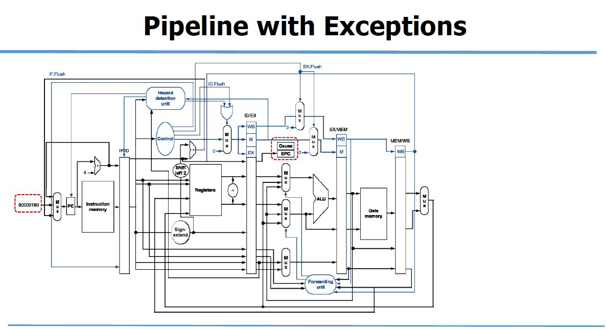

## Exceptions and Interrupts

"Unexpected" events requiring change in flow of control

**Exception**(예외): Arises within the CPU

**Interrupt**(인터럽트): From an external I/O controller

------

**Handling Exceptions**

In mips, 

exception managed by a System Control Coprocessor (CP0)

1. **Save PC** of offending or interrupted instruction (**EPC: Exception Program Counter**)
2. **Save indication** of the problem

3. Jump to handler at 8000 0180(hex)

------

**An Alternate Mechanism**

- **Vectored Interrupts**: Handler address determined by the cause
- Undefined opcode: 8000 0000(hex)
- Arithmetic overflow: 8000 0180(hex)

------

**Handler Actions**

Read cause, transfer to relevant handler

Determine action required

- 만약 restartable의 경우

  Take corrective action

  **Use EPC to return to program**

- Otherwise

  Terminate program

  Report error using EPC, cause

------

**Exception in a Pipeline**

form of control hazard 다른 형태로 취급

EX stage에서 add명령어가 산술 오버플로우를 가진다고 생각했을 때, 

EX) add $1, $2, $1

1. add명령어의 다음 명령어들을 pipeline에서 쓸어버린다. 이 때, $1은 사라지지 않게 한다.
2. 이전 명령어를 완료한다.
3. add와 subsequent instructions를 flush한다.
4. Cause (예외의 원인을 기록하기 위한 레지스터)와 EPC(예외를 발생시킨 명령어의 주소를 저장하기 위한 레지스터) 의 값을 설정한다.
5. 핸들러에게 제어를 전달한다.

------

> 중요한 변화는 멀티플렉서에 8000 0180(hex) 값을 갖는 새 입력을 추가하여 새로운 PC값을 제공한다
>
> Cause 레지스터: 예외를 일으킨 원인을 기록하기 위한 레지스터
>
> EPC 레지스터: 예외를 일으킨 명령어의 주소를 저장하기 위한 레지스터
>
> 8000 0180(hex): 예외가 발생했을 때, 명령어를 인출하기 시작할 초기 주소

------

**Exception Properties**

1. Restartable exceptions

   - Pipeline can flush the instruction: 파이프라인은 명령어를 없앨 수 있다.

   - Handler executes, then returns to the instruction: 핸들러를 실행한 

     다음 명령어로 돌아간다

2. PC saved in EPC register

   - causing instruction를 식별한다

   - 오류가 나지 않았다면, 실제적으로 PC+4를 저장한다 

     (예외 처리 루틴에서는 PC에서 4를 빼야한다)

------

**Multiple Exceptions**

pipelining은 다수의 명령어가 겹친다.

> Could have multiple exceptions at once

Simple approach: 최초의 명령어의 exception을 다룬다

> "Precision" exceptions

In complex pipelines

> 각 cycle마다 다수의 명령어는 발생
>
> 순서에 맞지 않은 완성
>
> precise exceptions을 유지하는 것은 어렵다

------

**Instruction-Level Parallelism(ILP)**

pipelining: execute multiple instructions in parallel

To increase ILP

1. deeper pipelining

   Less work per stage => shorter clock cycle

2. Multiple issue

   Replicate pipeline stages => multiple pipelines

------

**Multiple Issue**

1. Static

   Compiler groups instructions to be issued together (컴파일러가 발행할 명령어를 함께 그룹화 한다)

   Packages them into "issue slots" (그룹화 된 명령어들은 issue slot에 들어간다)

   Compiler detects and avoids hazards (컴파일러는 해저드를 탐색하고 피한다) 

2. Dynamic

   CPU examines instruction stream and choose instructions to issue each cycle (CPU는 명령어 스트림을 검사하고 각 사이클마다 발행할 명령어를 선택한다)

   Compiler can help by **reordering instructions** (컴파일러는 명령어 재배치를 할 수 있다)

   CPU resolves hazards using advanced techniques at runtime (CPU는 런타임기술을 이용하여 해저드를 해결한다)

   ------

   **Speculation**

   : Guess what to do with an instruction

   1. 가능한 빠르게 operation을 시작한다

   2. 추측한 것이 맞는 지 확인한다

      맞다면: operation이 완료된다.

      틀림다면: roll-back하고, 올바른 operation을 진행한다

   > compiler는 명령어의 reorder이 가능하다
   >
   > hardware는 실행하기 위한 명령어들을 look ahead할 수 있다