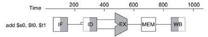

## Pipelining (파이프라인기법)

**Hazards**

> 파이프라인이 가지는 결함들: 다음 사이클에서 다음 명령어를 실행하지 못하는 상황을 말한다.
>
> 1. Structure hazards
>
>    **: 필요한 자원들을 사용하지 못하는 경우**
>
> 2. Data hazards
>
>    **: data를 읽고 쓰는 명령어의 수행이 완료되기 위해서는 이전 명령어를 기다려야함** 
>
> 3. Control hazards
>
>    : **이전 명령어에 따라 제어 행동을 결정함**

------

**Structure Hazards**

: 자원 사용에서의 충돌

단일 메모리를 가지는 MIPS 파이프라인

- Load/Store는 data 접근이 필요함
- 구조적인 문제가 생겨서 다음 단계로 넘어가지 못하고, 그 단계에 머물러 있게 되는 문제가 발행하는데 이를 **버블**(Bubble)이라고 한다.

> **그래서, 파이프라인 datapath에서는 instruction과 data의 메모리 혹은 캐시를 분리해야 한다**
>
> **pipeline register를 사용한다**

------

**Instruction pipeline**

- 오른쪽 shading은 read를 의미
- 왼쪽 shading은 write를 의미
- shading이 없는 것은 사용하지 않음을 의미

------

**Data Hazards**

현재 명령어가 이전 명령어에 의한 data 완성에 의존한다

예시)

add $s0, $t0, $t1

sub $t2, $s0, $t3

<u>이 경우에는 add라는 명령어에서 s0가 계산될 때까지의 시간이 소요된다</u>

------

**Forwarding (=Bypassing)**

결과값을 **write back**(레지스터에 data를 저장하는 단계) 할 때까지 기다리는 것이 아니라 **hardware connection**을 통해서 바로 data 값을 받을 수 있게 하는 것을 의미한다

------

**Load-Use Data**

하지만 forwarding이 항상 가능한 것이 아니다.

예시)

lw $s0, 20($t1)

sub $t2, $s0, $t3

<u>이 경우에는 lw명령어의 MEM-WB단계에서 sub의 ID-EX단계로 hardware connection을 만드는 것은 역순이므로 불가능하다.</u>

**그래서 버블(bubble, 혹은 pipeline stall)이 필요하며, 이 시간은 어쩔수 없이 소요되는 시간이다**

------

**Reordering Code**

: Load-Use Data Hazard를 해결하기 위한 방법

예시)

[원래 코드 순서]

lw $t1, 0($t0)

lw **$t2**, 4($t0)

add $t3, $t1, **$t2**			**"stall 발생"**

sw $t3, 12($t0)

lw **$t4**, 8($t0)

add $t5, $t1, **$t4**			**"stall 발생"**

sw $t5, 16($t0)

[ reordering한 코드]

lw $t1, 0($t0)

lw **$t2**, 4($t0)

lw **$t4**, 8($t0)

add $t3, $t1, **$t2**			

sw $t3, 12($t0)

add $t5, $t1, **$t4**			

sw $t5, 16($t0)

**lw와 arithemetic이 있을 때는 lw를 먼저하도록 배치하면 bubble을 해결할 수 있다**

------

**Control Hazards**

: 다음 instruction을 fetch하는 것은 분기 결과값(branch outcome)에 의존한다

**Stall on Branch**

: 다음 instuction을 fetch하기 전에 branch outocme이 결정되기 전까지 기다려야한다

------

**Branch Prediction**

: branch를 미리 예측하면 버블을 없앨 수 있고, 예측이 틀리다면 버블이 발생하게 된다

1. 정적 분기 예측 (static branch prediction)

   분기가 일어나지 않을 것으로 예측 -> 항상 다음 명령어를 인출

   분기가 항상 일어날 것으로 예측 ->항상 목적지로부터 명령어를 인출

   연산 코드에 의한 예측 -> 분기 연산 코드들에 대한 분기 발생 여부를 가정

2. 동적 분기 예측 (dynamic branch prediction)

   실행 history를 보고 가능성 있는 branch 행동을 정한다 

   만약, 예측이 틀렸다면 re-fetching을 하는 동안 stall이 발생하고 history를 업데이트 한다

------

Control lines in each stage

1. IF : No control 

2. ID: No control

3. EX: 

   - Result Register(RegDst) 

   - ALU Operation (ALUOp)
   - Read data 2 or sign-extended immediate for ALU(ALUSrc)

4. MEM:

   - Branch: beq
   - MemRead: lw
   - MemWrite: sw

5. WB

   - MemtoReg: ALU result or memory value
   - RegWrite: R-type, lw

------

> 파이프라인은 **instruction 처리량을 증가시킴**으로써, **성능을 개선**할 수 있다