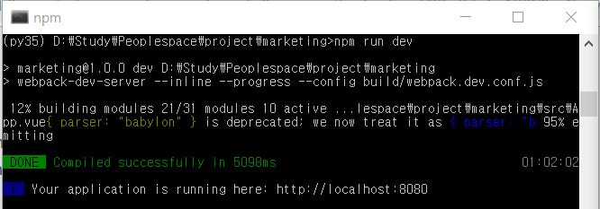
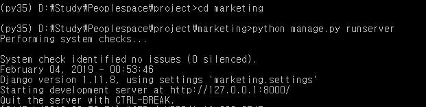

# NLP_CA  
  
## This is project collaborated between Django and Vue.js using Rest_framework.router  
I just referred to this site's post. 

### It is how to make a project from scratch
[Post's Link](https://ahackersday.com/blog/building-a-todo-app-using-vue-js-and-django-as-the-backend/?fbclid=IwAR2Y8-uGpvvwktNAvnRwBom8MyIApLbNbi7I22yCwEneqFl55VRb10Q_RMc)  

### If you clone this project, just install bellow dependancy.

#### install django and packages

```  
$ virtualenv -p vuengo_env
$ cd vuengo_env
$ source bin/activate
$ pip install django
$ pip install djangorestframework
$ pip install django-cors-headers
```
#### run django server

```
$ python manage.py runserver
```
#### Setting up Vue

```
$ npm install -g vue-cli
$ npm install axios
```
  
## How to run server  
How to run Vue.js App  
  
How to run Django Server  
  
  
To run and test the application, Admin account would be needed.  
**ID  : admin**  
**PW  : admin123!**  

